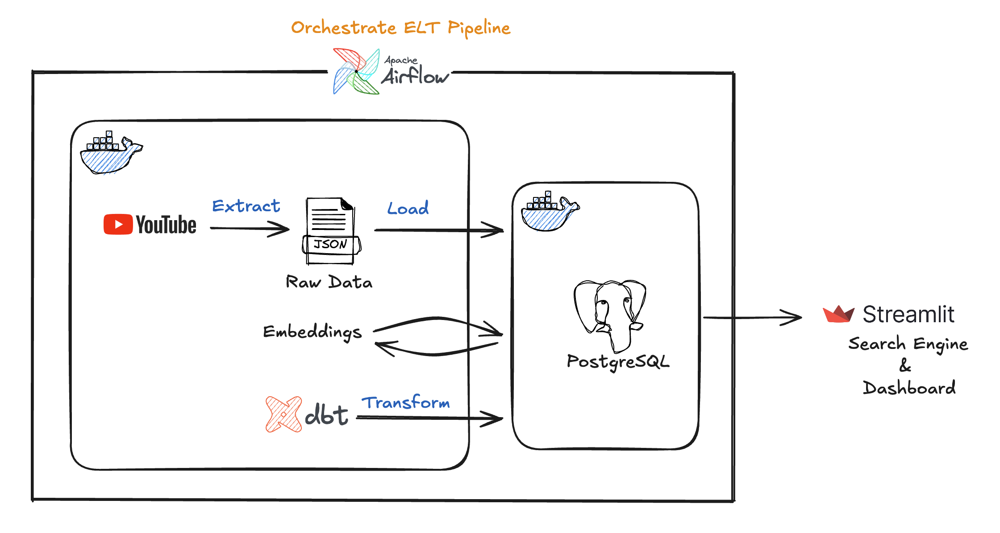
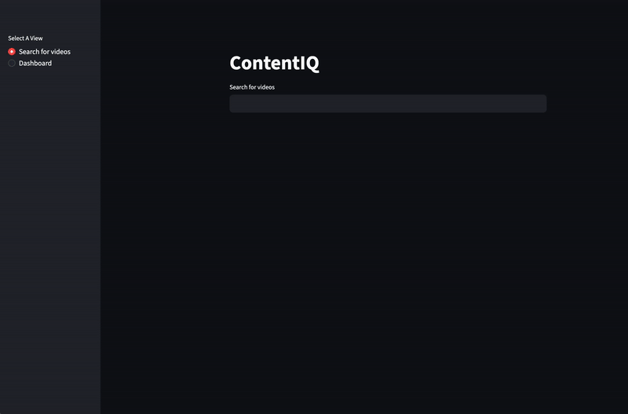
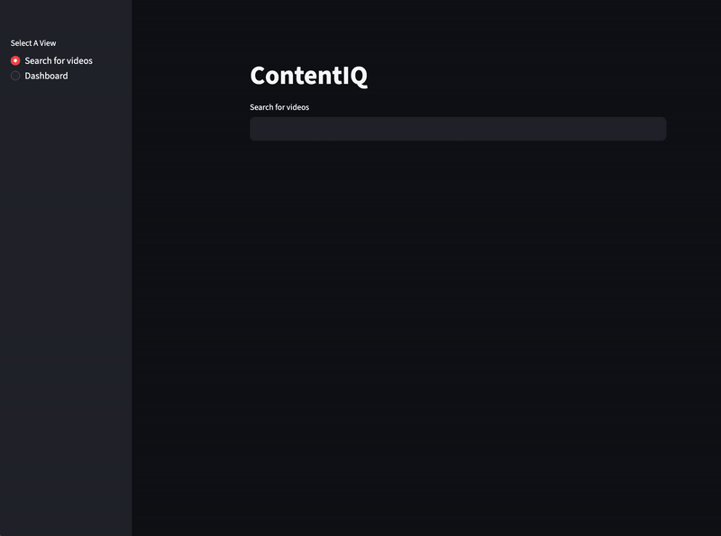

# ContentIQ: YouTube Analytics & Recommendation Pipeline

A production-ready data pipeline featuring workflow orchestration (Airflow), data transformation (dbt), and semantic search capabilities for content discovery.

## Overview

ContentIQ analyzes 24 YouTube educational channels (~15,000 videos), providing semantic search for content discovery and engagement analytics. Built to demonstrate production data engineering practices: automated orchestration, incremental loading, and cost-optimized refresh strategies.


## Tech Stack


## Architecture




## Demo

### Search & Recommendations


### Analytics Dashboard


## Key Features
- **Automated orchestration** - 3 Airflow DAGs with Dataset-based dependencies
- **Tiered refresh strategy** - Cost-optimized: 1/3/7/30 day refresh cycles by video age
- **Semantic search** - pgvector HNSW index for sub-10ms similarity queries
- **Production patterns** - State management, incremental loading, fault tolerance
- **Analytics dashboard** - Bayesian-smoothed engagement metrics, channel performance quadrants

## Technical Highlights
**Why Tiered Refresh?** Videos <7 days old see daily stat updates; mature 
content (30+ days) refreshes monthly. Reduces API calls by 60% while keeping 
recent data fresh.

**Why Bayesian Smoothing?** New videos with 5 views, 1 like aren't "20% 
engagement" - that's noise. Smoothing with global prior (k=400) ensures 
fair quality signals.

## Quick Start
   1. Clone repo and add `.env` with YouTube API key
   2. `docker network create contentiq-network`
   3. `docker-compose up -d` (PostgreSQL)
   4. `docker-compose -f airflow-docker-compose.yaml up` (Airflow)
   5. Access Streamlit at `localhost:8501`, Airflow at `localhost:8080`

## Repository Structure
<details>
<summary>click to expand</summary>

```bash
contentiq/
├── app.py
├── contentiq_dbt
│   ├── analyses
│   ├── dbt_project.yml
│   ├── models # DBT models for analytics and data refreshment schedule 
│   │   ├── channel_average.sql
│   │   ├── engagement_rate.sql
│   │   ├── global_average.sql
│   │   ├── relative_performance.sql
│   │   └── videos_to_refresh.sql
│   └── profiles.yml
│   
├── dags # DAGs for orchestration
│   ├── dbt_model_taskflow.py
│   ├── incremental_taskflow.py
│   ├── refresh_taskflow.py
│   └── utils
│       └── email.py
├── data
│   └── raw
├── docker-compose.yml
├── Dockerfile
├── airflow-docker-compose.yaml
├── init.sql
├── requirements.txt
└── scripts
    ├── channel_constraint.py
    ├── extract.py
    ├── generate_embeddings.py
    ├── load.py
    └── state_manager.py

```

</details>